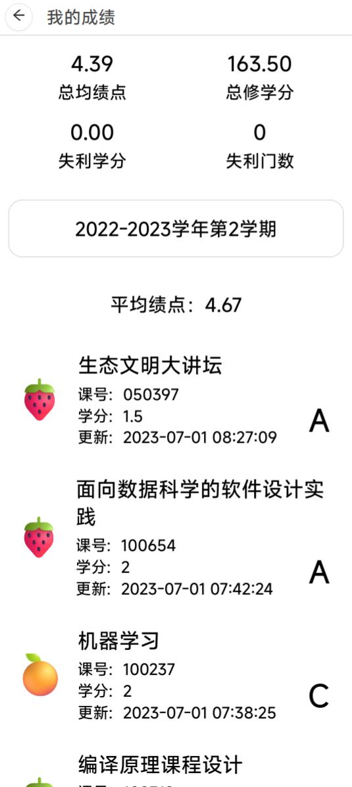

# 页面路由体系与页面结构

onetj-webapp （后称“本app”）的页面路由体系与页面结构基于果团团控制台相关设计开发，传承果团团控制台页面路由体系与页面结构的全部代码，并在其上针对新需求开展调整。

## 多页面简介

本app拥有多个页面，但他们一同组成一个完成的类app，而不是多个需要独立加载的小页面。它就像一个 android app 一样，表面上看拥有很多不同的 activity （子页面），实际上整体是同一个 application （或者说只有唯一的 index.html）。

页面路由体系正是用于实现这一效果的。

## 基本结构

本app的路由系统底层是 React Router。为适应不同部署环境，采用 Hash Router 的模式。

所有页面请求都应被指向 index.html，react router 根据 “#” 后的路径来决定展示什么页面。

例：

对于地址 `https://onetj-webapp.gardilily.com/onetj#/func/my-grades?term=1`，其表示正在访问路径 `/func/my-grades`，并携带一个参数 `term=1`。可以发现，请求参数也成为了 hash 的一部分。

当然，对于部分从外部 oauth 返回的情况，需要手动处理 hash 位于 request 之后的情形。例如针对地址 `https://xxx.com/onetj?sessionid=xxx&status=xxx/#/oauth?key1=value1`，需要手动提取 `sessionid`和 `status`，并在使用后将其删除，以防干扰其他页面。后文中默认只考虑本app内页面跳转的参数传递。

## 页面传参

所有请求参数传递都使用 react router 提供的参数管理工具 `useSearchParams` 完成。这样，所有请求参数都会被拼接到 hash 内。

## app结构和基本组件

### index.tsx

React App 的入口是 `index.tsx`，本app也不例外。但是，我们认为，真正的app入口是 `AppMain.tsx`。于是，我们在 `index.tsx` 内使用 antd ConfigProvider 直接包裹一个 AppMain 对象，提交给 React DOM 管理器。

antd ConfigProvider 可以配置 ant design 的一些参数，如深色模式和主题色。

### AppMain.tsx

这才是我们认为的程序进入点。

AppMain 对象需要完成整个 app 生命周期内的一些初始化工作，如初始化 axios 工具的一些配置。

AppMain 会根据我们配置的路由表 `common/PageRoutes.tsx`，生成所有页面的路由，一并交给 Hash Router。对于未定义的页面，它会提供一个默认的 404 页面。

AppMain 的任务十分简单。由于生成的页面已经根据路由表配置好了路径，Hash Router 可以自动完成不同页面之间的跳转处理。

### components/LayoutFrame

果团团控制台页面如下：

| 登录页：无边框                         | 首页：有边框                        |
| -------------------------------------- | ----------------------------------- |
|  |  |

可以看出，页面（首页）被分为三大部分：左边栏、标题栏、页面主体。我们将其中的左边栏和标题栏统称为“边框”。

对于部分页面，如登录页，如果也嵌在边框内，会显得不好看。相比之下，一个全屏的登录页会更加吸引人。

LayoutFrame 结构则是一个通用的边框，在有需要时被添加到页面上。考虑到本app针对移动端开发，左边栏应该被删去，仅保留顶栏。

| 登录页：无边框                 | 成绩页：有边框                 |
| ------------------------------ | ------------------------------ |
|  |  |

LayoutFrame 提供一个 title，并提供一个返回按钮。其实，LayoutFrame 还允许开发者在标题栏上显示一个“加载中”提示图标，但实际情况下这个图标很不明显，不好用。

LayoutFrame 为页面提供了一个嵌入位置。页面本体需要将自己的定位设为“absolute"，并将宽高都设为“100%”，以填满这片区域，之后 LayoutFrame 被暴露给 Hash Router。如果不需要 LayoutFrame，则相应页面会直接被暴露给 Hash Router。

LayoutFrame 本体是和页面对象分离的。页面可以通过 React Ref 来取得 LayoutFrame 对象。注意，Page 和 LayoutFrame 的渲染完成顺序是不一定的，Page 调用 LayoutFrame 的能力时，会产生竞争冒险问题。

目前，将页面对象载入LayoutFrame（后文会介绍）以及设置页面标题的功能已经通过特殊处理避免竞争冒险，可以放心使用。

### common/PageRoutes.tsx

该模块登记整个app所有页面的路由信息，是一张“路由表”。

每个页面都拥有一些基本信息：

* 页面路由，如：func/my-grades （注：不应以 “/” 开头）
* 页面标题，如：我的成绩
* 图标，本app暂不使用
* 页面对象，是一个 React Component 对象
* 是否在框内，用于登记要不要将这个页面放到 LayoutFrame 里
* 分类，本app暂不使用
* 权限，本app暂不使用

新建页面后，需要在本模块的 PageRouteManager.routes 内登记页面信息。

同时，需要在页面对象内拿到本页面的基本信息，并将其交给 LayoutFrame：

```typescript
// 假如该page的路径为：func/cet-score
export default function XXXPage() {

    const pageEntity = PageRouteManager.getRouteEntity('func/cet-score')
    loadPageToLayoutFrame(pageEntity)

    ...

    /* render */
    return <div> ... </div>
}
```

PageRoute 模块会自动对页面信息进行初始化。例如，如果你希望某个页面被 LayoutFrame 包裹，只需要设置相应的参数值，初始化程序会完成具体“包裹”工作。
